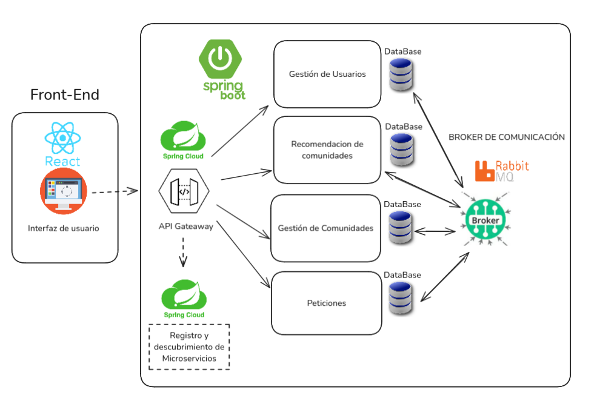
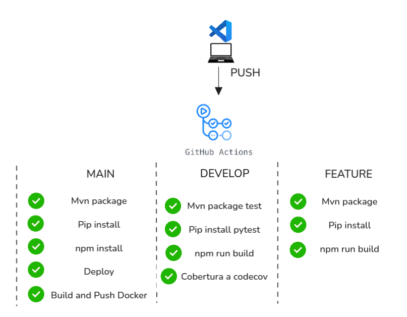

# Trabajo de Fin de Grado: Sistema multiplataforma para la búsqueda y gestión de pisos compartidos

**Repositorio oficial del Trabajo de Fin de Grado de Alonso Doña Martínez – Universidad de Granada.**  

**Autor:** Alonso Doña Martínez  
**Tutor:** Luis López Escudero

## Descripción
Este proyecto consiste en el desarrollo de una plataforma de búsqueda y gestión para comunidades de co-housing siguiendo una arquitectura de microservicios, integración continua y tecnologías modernas.

La arquitectura general del proyecto se muestra en el siguiente diagrama, donde se reflejan los distintos microservicios y
la relación que existe entre ellos.



## Generación de la documentación

Para generar el PDF de la documentación, necesitas tener instalado **TeXLive** en tu sistema.  

Pasos para compilar la documentación:

Situarse en el directorio `doc`:
---

## Flujo a seguir en el desarrollo del proyecto
main             ← producción estable, despliegue en github pages del frontend , y dockerfile de los micros en Docker Hub. Se despliegan iteraciones completadas

develop          ← integración y pruebas. Se suben resultados a codecov para generar informe de cobertura, se compilan los micros y se ejecuta npm run dev en el frontend transpilando y arrancando un servidor de desarrollo. Se suben historias de usuario terminadas.

Crea ramas feature/* para desarrollar cada historia de usuario.  ← se compilan los micros y se ejecuta npm run dev en el frontend transpilando y arrancando un servidor de desarrollo, se arranca el servidor del microservicio en FastAPI.

Cuando termines una historia de usuario, haz PR a develop.

En develop se hacen pruebas e integración de los servicios.

Si todo va bien, mergeas develop a main para desplegar a producción.

## 🚧 Covertura Actual en Producción

| Rama | CI/CD Status | Cobertura |
|------|--------------|-----------|
| `main` | [](https://github.com/alonsodm12/TFG_COHOUSING/actions/workflows/ci-cd.yml) | [](https://codecov.io/gh/alonsodm12/TFG_COHOUSING) |

---

## 🔧 Tecnologías utilizadas en la realización del proyecto

- ⚙️ **Backend**: Java 17, Spring Boot, Maven  
- 🧪 **Testing**: JUnit, Jacoco, Codecov  
- 🌐 **Frontend**: React, TypeScript  
- 🐳 **Contenedores**: Docker & Docker Compose  
- 🛠️ **CI/CD**: GitHub Actions, Docker Hub  
- 🔐 **Seguridad**: Spring Security + JWT
- 📡 **Comunicación**: REST API, RabbitMQ  
- 🗃️ **BBDD**: PostgreSQL
- ☁️ **DESPLIEGUE**: Railway

---

## 🧱 Estructura del repositorio

```plaintext
TFG_COHOUSING/
├── .github/workflows/       # Workflows de CI/CD
├── docs/                    # Memoria del proyecto e imagenes para el Readme.md.
├── front-end/               # Aplicación React + TypeScript
│   ├── features/            # Lógica encapsulada en el Frontend
│       │── users/           # Lógica y Views relacionadas con la entidad Usuarios
├── microservicios/          # Carpeta principal de microservicios
│   ├── GestionUsuarios/     # Microservicio de usuarios
│   ├── GestionComunidades/  # Microservicio de comunidades
│   ├── Recomendador/        # Microservicio de recomendaciones
│   └── ...
├── docker-compose.yml       # Archivo para el despliegue en local de la infraestructura completa (5 micros + 3 BBDD + front-end + Rabbitmq)
├── README.md
└── .gitignore
```
## 🎯 Objetivos del proyecto

- ✅ Facilitar la convivencia organizada en comunidades de co-housing  
- ✅ Permitir la gestión autónoma por parte de los residentes  
- ✅ Automatizar flujos de petición, reserva y asignación de recursos  
- ✅ Aplicar buenas prácticas de ingeniería del software: DDD, CI/CD, testing, etc.  
- ✅ Servir como demostración de competencias en arquitectura y desarrollo backend/frontend  

---

## 🧪 Testing y cobertura

Todos los microservicios están integrados con **Jacoco** para generar cobertura de tests y con **Codecov** para visualizar los reportes de forma centralizada.

## ⚙️ Automatización CI/CD

Con cada **push** o **pull request** se ejecuta automáticamente el siguiente flujo:

 

🔧 Archivos del workflow: `.github/workflows/`


## 🧠 Metodología
- Diseño Basado en Domain-Driven Desing (DDD)
- Metodología ágil (Scrum)
- Scream Architecture (Front-End)
- Arquitectura en Capas (Back-End)

